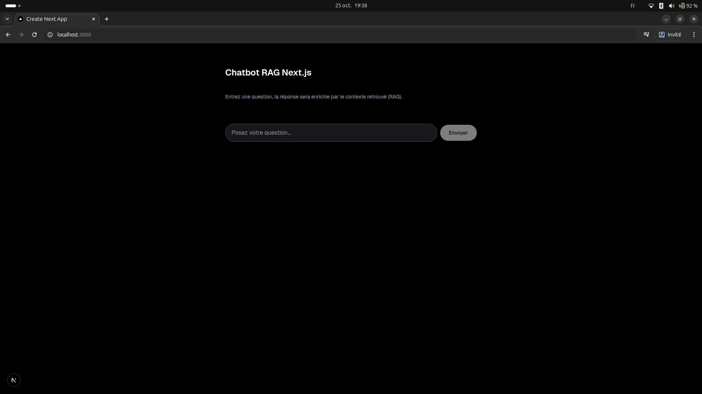

# NexusBot — Template Chatbot Next.js RAG (Supabase + OpenRouter)
 [](LICENSE)



NexusBot est un template minimaliste et prêt à l’emploi d’un chatbot Next.js intégrant un pipeline RAG (Retrieval Augmented Generation) avec Supabase/pgvector pour la recherche de similarité, et OpenRouter pour l’accès flexible aux modèles de langage (GPT, Claude, Llama, etc).

> Repo structure: l’application Next.js vit dans le dossier `nextjs-rag-chatbot/`.

---

## Sommaire

- [Fonctionnalités](#fonctionnalités)
- [Tech Stack](#tech-stack)
- [Prérequis](#prérequis)
- [Installation](#installation)
- [Configuration des variables d’environnement](#configuration-des-variables-denvironnement)
- [Initialisation Supabase & pgvector](#initialisation-supabase--pgvector)
- [Ingestion de données (RAG)](#ingestion-de-données-rag)
- [Lancement et utilisation](#lancement-et-utilisation)
- [Architecture](#architecture)
- [Personnalisation](#personnalisation)
- [Déploiement](#déploiement)
- [Dépannage (FAQ)](#dépannage-faq)
- [Crédits & Licence](#crédits--licence)

---

## Fonctionnalités

- Interface de chat minimaliste (Next.js App Router)
- RAG complet via Supabase + `pgvector` (cosine distance)
- Streaming de réponse côté client (UX fluide)
- Provider d’embeddings par défaut: Supabase/gte-small (384 dims, Transformers.js)
- Option d’embeddings OpenAI (basculement via ENV)
- Script d’ingestion prêt pour `.md`, `.txt` et `.pdf`
- ESLint + Prettier (style cohérent), Tailwind CSS v4

## Tech Stack

- Frontend/Framework: Next.js 16 (App Router), React 19, Tailwind CSS 4
- Base de données: Supabase (PostgreSQL)
- Vector search: `pgvector` (HNSW, cosine)
- LLM: OpenRouter (modèle par ENV, ex: `openai/gpt-4o-mini`)
- Embeddings: `Supabase/gte-small` (Transformers.js, ONNX) | option OpenAI

## Prérequis

- Node.js 18+ (recommandé 20+)
- Un projet Supabase (ou créez-en un)
- Une clé API OpenRouter
- (Optionnel) Une clé OpenAI si vous basculez les embeddings vers OpenAI

## Installation

```bash
# À la racine du repo
cd nextjs-rag-chatbot
npm install
# ou pnpm i / yarn
```

## Configuration des variables d’environnement

Créez un fichier `nextjs-rag-chatbot/.env.local` à partir de `.env.example`:

```dotenv
# Supabase
NEXT_PUBLIC_SUPABASE_URL=...
SUPABASE_ANON_KEY=...
# Optionnel: pour scripts serveur/ingestion
# SUPABASE_SERVICE_ROLE=...

# OpenRouter (LLM)
OPENROUTER_API_KEY=...
OPENROUTER_MODEL=openai/gpt-4o-mini
# Optionnels (ASCII uniquement)
# OPENROUTER_HTTP_REFERRER=https://example.com
# OPENROUTER_X_TITLE=NexusBot

# Embeddings provider (default: Supabase via Transformers.js)
EMBEDDINGS_PROVIDER=supabase
SUPABASE_EMBEDDING_MODEL=Supabase/gte-small

# RAG
RAG_MATCH_THRESHOLD=0.78
RAG_MATCH_COUNT=8

# (Optionnel) OpenAI pour embeddings
# OPENAI_API_KEY=...
# OPENAI_EMBEDDING_MODEL=text-embedding-3-small
```

Notes sécurité:
- Ne divulguez JAMAIS `SUPABASE_SERVICE_ROLE` côté client. Utilisez-la uniquement localement pour l’ingestion, ou via des fonctions/serveurs sécurisés.

## Initialisation Supabase & pgvector

1) Créez (ou utilisez) un projet Supabase.
2) Activez l’extension `pgvector` et créez le schéma RAG:
   - Exécutez le SQL du fichier: `nextjs-rag-chatbot/supabase/migrations/0001_init_pgvector.sql`
   - Cela crée la table `public.documents` (embedding `vector(384)`), l’index HNSW, et la fonction `public.match_documents`.

Alternative (avancée): via Supabase CLI/MCP, appliquez la migration directement sans passer par Studio.

## Ingestion de données (RAG)

Le script d’ingestion découpe un fichier texte/markdown/pdf en morceaux, génère des embeddings, et insère dans `public.documents`.

Commandes typiques:

```bash
# Exemple PDF avec limites prudentes (évite Out Of Memory)
NODE_OPTIONS="--max-old-space-size=2048 --expose-gc" \
npm run ingest -- \
  --file /chemin/vers/votre.pdf \
  --chunk-size 4000 \
  --overlap 320 \
  --max-chars 5000000 \
  --max-chunks 2000

# Exemple Markdown/Texte simple
npm run ingest -- --file ./docs/intro.md
```

Options disponibles:
- `--chunk-size` (par défaut 800)
- `--overlap` (par défaut 100)
- `--max-chunks` (limite dure du nombre de morceaux)
- `--max-chars` (tronque le texte avant le découpage)

Provider d’embeddings:
- Par défaut `EMBEDDINGS_PROVIDER=supabase` (Transformers.js). Première exécution: téléchargement des poids `Supabase/gte-small`.
- Pour basculer sur OpenAI: `EMBEDDINGS_PROVIDER=openai` + `OPENAI_API_KEY`.

## Lancement et utilisation

```bash
npm run dev
# http://localhost:3000
```

- Entrez une question dans l’UI. La réponse est streamée.
- Le contexte RAG est injecté à partir des documents ingérés (via `match_documents`).

Scripts utiles:
- `npm run build`, `npm start`
- `npm run lint`, `npm run typecheck`, `npm run format`
- `npm run ingest`

## Architecture

```
[UI React] --(POST /api/chat)--> [Route Next.js]
   |                                 |
   |                             [buildRagPrompt]
   |                                 |
   |                       [getRagContext(query)]
   |                         |            |
   |                   [generateEmbedding] |
   |                    (Supabase gte)     |
   |                         |            |
   |                    [Supabase RPC: match_documents]
   |                                 |
   |                     [OpenRouter: chat.completions]
   |                                 |
   <-- stream (SSE-like)  <-----------
```

- `lib/embeddings.ts`: embeddings (Supabase/gte-small via Transformers.js, ou OpenAI)
- `lib/rag.ts`: context RAG (embedding + `match_documents`)
- `app/api/chat/route.ts`: streaming OpenRouter → client
- `components/chat.tsx`: UI de chat minimaliste

## Personnalisation

- **Modèle LLM**: changez `OPENROUTER_MODEL` (ex: `anthropic/claude-3.5-sonnet`)
- **Embeddings**: 
  - Supabase par défaut (384 dims) – modèle `Supabase/gte-small`
  - OpenAI: `EMBEDDINGS_PROVIDER=openai`, `OPENAI_API_KEY`, `OPENAI_EMBEDDING_MODEL`
- **Paramètres RAG**:
  - `RAG_MATCH_THRESHOLD` (0–1, plus haut = plus strict)
  - `RAG_MATCH_COUNT` (nombre de morceaux remontés)
- **UI**: Tailwind 4 – ajoutez vos composants, thèmes, etc.

## Déploiement

- Vercel (recommandé pour Next.js). Pensez à définir les variables d’environnement dans le dashboard.
- Supabase: conservez l’URL et la clé `anon` pour l’app, `service_role` uniquement côté serveur.
- Mémoire/embeddings: sur Vercel, préférez OpenAI pour l’ingestion (moins gourmand) ou ingérez hors-ligne.

## Dépannage (FAQ)

- Erreur ByteString côté requête OpenRouter (caractère non ASCII dans les headers):
  - `OPENROUTER_HTTP_REFERRER` et `OPENROUTER_X_TITLE` doivent être ASCII. Le code assainit ces valeurs, mais gardez-les simples.
- OOM (Out Of Memory) pendant l’ingestion PDF:
  - Utilisez `--max-chars`, `--max-chunks`, et `NODE_OPTIONS="--max-old-space-size=... --expose-gc"`.
  - Alternative: basculer temporairement `EMBEDDINGS_PROVIDER=openai` le temps d’ingérer.
- Pas de réponses RAG:
  - Vérifiez que la table `public.documents` contient des lignes
  - Vérifiez `RAG_MATCH_THRESHOLD` et `RAG_MATCH_COUNT`

## Crédits & Licence

- Supabase, pgvector, OpenRouter, Transformers.js (Xenova), Next.js, Tailwind CSS
- Licence: MIT (ajoutez un fichier `LICENSE` si nécessaire)

---

Faites-nous part de vos retours et idées d’amélioration. Bon build avec NexusBot !
